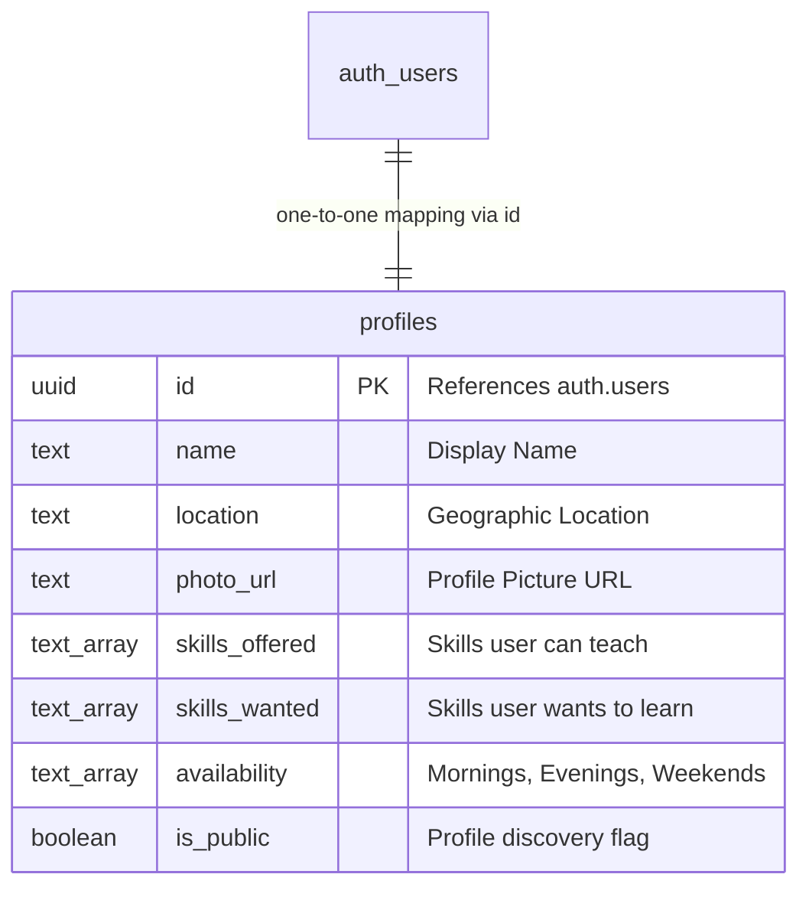

# 🔁 Skill Swap Platform

> A modern peer-to-peer knowledge-sharing platform enabling collaborative, cost-free skill exchanges.

[](https://vitejs.dev/)
[](https://reactjs.org/)
[](https://www.typescriptlang.org/)
[](https://tailwindcss.com/)
[](https://supabase.com/)

---

## 📖 Table of Contents
- [Project Overview](#-project-overview)
- [Key Features](#-key-features)
- [Tech Stack](#-tech-stack)
- [System Architecture & Database Schema](#-system-architecture--database-schema)
- [Getting Started](#-getting-started)
  - [Prerequisites](#prerequisites)
  - [Installation](#installation)
  - [Environment Configuration](#environment-configuration)
- [Core Application Flows](#-core-application-flows)
- [Roadmap](#-roadmap)
- [Contributing](#-contributing)
- [License](#-license)

---

## 🧠 Project Overview
The **Skill Swap Platform** is a web-based decentralized ecosystem designed for individuals seeking to exchange skills and knowledge without financial barriers. Born out of a hackathon to address the challenges of peer-to-peer (P2P) education, the platform pairs users based on mutual educational interests. 

Whether you are looking to exchange coding expertise for UI/UX mentoring, language skills for photography lessons, or business strategy for graphic design, this platform streamlines the process of discovering mentors, coordinating exchanges, and reviewing collaboration quality.

---

## 🌟 Key Features

### 👤 Profile & Privacy Control
- **Customizable Profiles:** Display your name, location, profile image, availability, and specific skill domains.
- **Skill Portfolios:** Explicitly categorize skills you are **offering** vs. skills you are **seeking**.
- **Granular Privacy:** Toggle profile visibility between Public (discoverable via search) and Private (hidden from matching queries).

### 🔍 Smart Skill Matching
- **Interactive Search:** Filter users dynamically by name or skill tags (e.g., JavaScript, Python, Figma).
- **Availability Filters:** Match with peers based on schedules (Mornings, Evenings, Weekends).
- **Rating Visibility:** Display user badges and average trust ratings out of 5 stars based on peer feedback.

### 🔁 Collaborative Swap Requests
- **Interactive Request Flow:** Send swap proposals detailing exactly what skill you offer and what you wish to learn.
- **Proposal Control:** Monitor both incoming and outgoing requests through separate tabs (Pending, Accepted, Rejected, Completed).
- **Actionable Statuses:** Accept/decline incoming requests, or retract sent proposals before they are reviewed.

### 🛡️ Admin Moderation Dashboard
- **Analytics & Metrics:** Real-time visibility into total registered users, active skills, and total swap transactions.
- **User Moderation:** Admin tools to restrict or flag accounts ensuring community safety.
- **System Logs:** Oversight of ongoing interactions to prevent spam and platform abuse.

### ⭐ Feedback & Rating Engine
- **Post-Swap Reviews:** Rate counterparts and write textual reviews upon completing a skill swap.
- **Reputation-based Matching:** Encourage positive community behavior via visible stars and review history.

---

## 🛠️ Tech Stack

| Layer | Technology | Purpose |
| :--- | :--- | :--- |
| **Frontend Framework** | [React 18 (TypeScript)](https://react.org/) | Type-safe, component-driven UI architecture. |
| **Build Tooling** | [Vite](https://vitejs.dev/) | Ultra-fast development server and production bundler. |
| **Styling & Theme** | [Tailwind CSS](https://tailwindcss.com/) & [shadcn/ui](https://ui.shadcn.com/) | Accessible, modern, and fully styled UI components. |
| **State Management** | [React Query (TanStack)](https://tanstack.com/query) | Efficient server state caching, fetching, and synchronization. |
| **Backend & Auth** | [Supabase](https://supabase.com/) | Managed PostgreSQL database, JWT-based user authentication, and profile synchronizations. |
| **Routing** | [React Router v6](https://reactrouter.com/) | Client-side routing and layout management. |
| **Icons** | [Lucide React](https://lucide.dev/) | Clean, consistent SVG icon set. |

---

## 🗄️ System Architecture & Database Schema

The platform integrates **Supabase Authentication** with a dedicated PostgreSQL table (`profiles`) to handle user accounts, sync attributes, and maintain search functionality.



*Note: Features like Swap Requests, Feedback Reviews, and Admin Statistics currently utilize local React state models on the frontend client and are prime candidates for complete Supabase relational mappings (see [Roadmap](#-roadmap)).*

---

## 🚀 Getting Started

Follow these steps to run a copy of the project on your local machine for development and testing.

### Prerequisites
Make sure you have the following installed:
- [Node.js](https://nodejs.org/) (v18.x or higher recommended)
- [npm](https://www.npmjs.com/) or [Bun](https://bun.sh/)
- A [Supabase](https://supabase.com/) Account & Project

### Installation

1. **Clone the Repository:**
   ```bash
   git clone https://github.com/SSSwetha25/skill-swap-platform.git
   cd skill-swap-platform
   ```

2. **Navigate to Frontend Directory:**
   ```bash
   cd frontend
   ```

3. **Install Dependencies:**
   ```bash
   npm install
   ```

### Environment Configuration

To enable user signups and logins, configure your Supabase connection:

1. In the `frontend` folder, create a `.env` file (or copy from `.env.example` if it exists):
   ```bash
   touch .env
   ```

2. Open the `.env` file and append your Supabase credentials:
   ```env
   VITE_SUPABASE_URL=your_supabase_project_url
   VITE_SUPABASE_ANON_KEY=your_supabase_anon_key
   ```
   *You can locate these keys in your Supabase dashboard under **Project Settings > API**.*

3. Set up the `profiles` table in your Supabase SQL Editor:
   ```sql
   create table profiles (
     id uuid references auth.users on delete cascade primary key,
     name text,
     location text,
     photo_url text,
     skills_offered text[],
     skills_wanted text[],
     availability text[],
     is_public boolean default true
   );

   -- Set up Row Level Security (RLS) policies
   alter table profiles enable row level security;
   
   create policy "Allow public read access to public profiles"
     on profiles for select
     using (is_public = true);

   create policy "Allow users to update their own profiles"
     on profiles for update
     using (auth.uid() = id);

   create policy "Allow users to insert their own profile"
     on profiles for insert
     with check (auth.uid() = id);
   ```

### Running Locally

To fire up the development server:
```bash
npm run dev
```
Open your browser and navigate to `http://localhost:5173` (or the port specified by Vite) to view the running app.

---

## 🔁 Core Application Flows

### 1. Account Creation & Onboarding
- When a user signs up, the application registers credentials in **Supabase Auth**.
- A hook then creates a corresponding record inside the `profiles` table to store non-authentication metadata (skills, availability, location).

### 2. Matching & Discovery
- The main page pulls existing profiles, matching those seeking specific skills with peers offering them.
- Users can use the filter options to coordinate schedules before initiating contacts.

### 3. Exchanging & Reviewing
- Request sender details their offer -> Recipient reviews and updates status -> Both users complete their sessions -> Reviews are logged to establish trust ratings.

---

## 🗺️ Roadmap
We plan to expand the platform with the following enhancements:
- [ ] **Full Database Persistency:** Move swap requests, feedback reviews, and admin dashboard stats from client memory to Supabase relational tables.
- [ ] **Real-time Chat:** Integrate a messaging channel directly into the Swap Requests page using Supabase Realtime/Websockets.
- [ ] **Calendar Integration:** Integrate a booking widget (e.g., Google Calendar, Cal.com) to schedule exchange sessions.
- [ ] **Skill Tags Auto-complete:** Use an AI-driven recommendations engine or standardization database for skill tags.

---

## 🤝 Contributing
Contributions make the open-source community an amazing place to learn, inspire, and create. Any contributions you make are **greatly appreciated**.

1. Fork the Project
2. Create your Feature Branch (`git checkout -b feature/AmazingFeature`)
3. Commit your Changes (`git commit -m 'Add some AmazingFeature'`)
4. Push to the Branch (`git push origin feature/AmazingFeature`)
5. Open a Pull Request

---

## 📄 License
Distributed under the MIT License. See `LICENSE` for more information.

